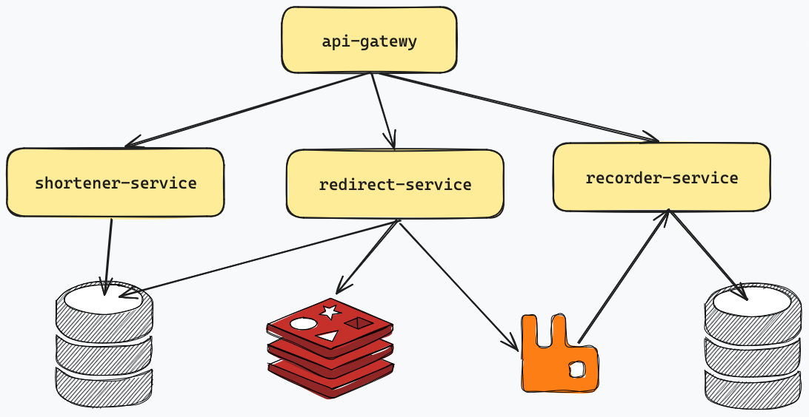

# URL shortener system

System is composed of:

- API Gateway service based on [Spring Cloud Gateway](https://spring.io/projects/spring-cloud-gateway)
- 3 [Spring Boot](https://spring.io/projects/spring-boot) applications
- 2 [SQL databases](https://mariadb.org/)
- a [RabbitMQ](https://www.rabbitmq.com/) queue
- a [Redis](https://redis.io/) cache



## Running locally

The entire system can be started with:

```shell
UID=$(id -u) GID=$(id -g) docker compose up --build
```

provided there is an `.env` file which defined all credentials used in the project:

- `URLS_DB_ROOT_PASSWORD`
- `URLS_DB_SHORTENER_PASSWORD`
- `URLS_DB_REDIRECT_PASSWORD`
- `URLS_CACHE_DEFAULT_PASSWORD`
- `URLS_CACHE_REDIRECT_PASSWORD`
- `EVENTS_QUEUE_REDIRECT_PASSWORD`
- `STATS_DB_ROOT_PASSWORD`
- `STATS_DB_RECORDING_PASSWORD`

You can bring the system down with:

```shell
UID=$(id -u) GID=$(id -g) docker compose down
```

By default, databases and the persisted queue will store their state in host directories mounted to their respective containers.
This means that system state such as shortened URLs and redirect statistics will persist across system restarts. If you need
to clear out local state you can bring the system down and run the `clear_local_data.sh` script which deletes relevant directories.

You can see usage statistics of the system with:

```shell
UID=$(id -u) GID=$(id -g) docker compose stats
```

and follow logs from particular service, e.g. api-gateway, with:

```shell
UID=$(id -u) GID=$(id -g) docker compose logs --follow api-gateway
```

## Testing

You can run automated JUnit tests for individual java services by running standard mvn command from their respective subdirectories,
for example:

```shell
cd api-gateway
mvn clean test
```

You can run all tests with a `run_all_tests.sh` script.

## Usage examples

Generate new short URL:

```shell
curl -i -X POST 'http://localhost:8080/v1/urls' \
-H 'content-type: application/json' \
--data '{"url": "https://www.infobip.com/docs/api", "customerId": "Infobip"}'
```

Retrieve details for all short URLs:

```shell
curl -i 'http://localhost:8080/v1/urls' \
-H 'content-type: application/json'
```

Retrieve details for one short URL:

```shell
curl -i 'http://localhost:8080/v1/urls/<short-code>' \
-H 'content-type: application/json'
```

Resolve previously generated short URL:

```shell
curl -i 'http://localhost:8080/<short-code>'
```

Check statistics by customer:

```shell
curl -i 'http://localhost:8080/v1/stats/Infobip'
```

## Simulating load

You can simulate load using the [vegeta tool](https://github.com/tsenart/vegeta). Prepare test targets by running the 
`prepare_targets.sh` script inside the `vegeta` directory. They run the `attack.sh` script. In addition to vegeta you'll 
also need curl and jq commandline tools installed locally for the prepare script to work. Alternatively you can create 
the `targets.http` script yourself based on the template from the prepare script.

## Control plane

System contains several admin UI services and Grafana's OpenTelemetry implementation for observability and monitoring.

For ease of use these have been exposed on different individual ports on the host machine:

- [On port 8000 phpMyAdmin](http://localhost:8000), a graphical admin tool for MariaDB databases.
- [On port 8001 Redis Insights](http://localhost:8001), a graphical admin tool for Redis stack.
- [On port 15672 RabbitMQ admin](http://localhost:15672), a graphical admin tool for RabbitMQ cluster.
- [On port 3000 Grafana](http://localhost:3000), a UI for accessing logs, metrics and traces.
